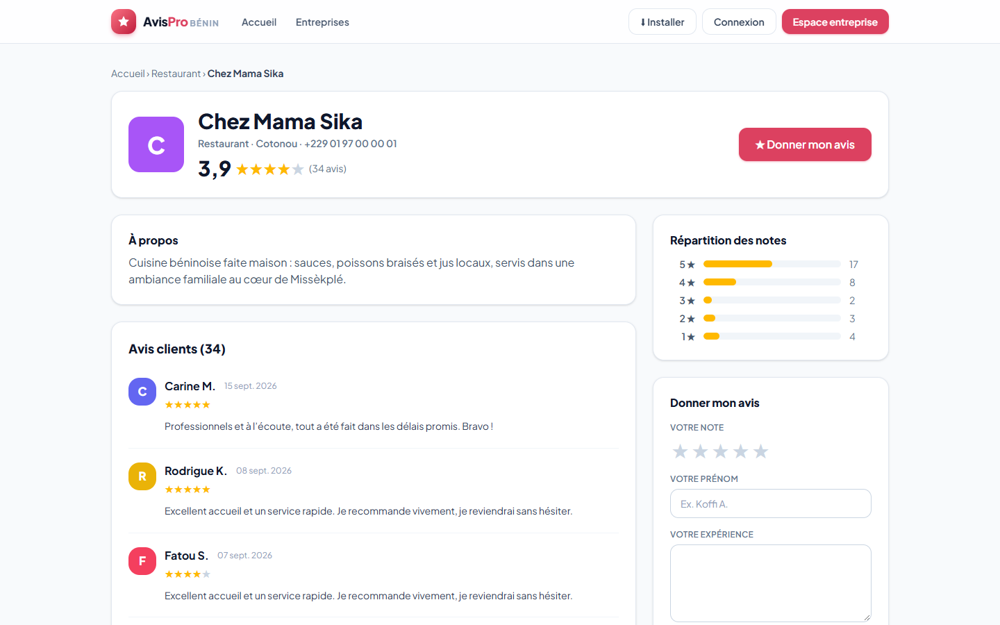
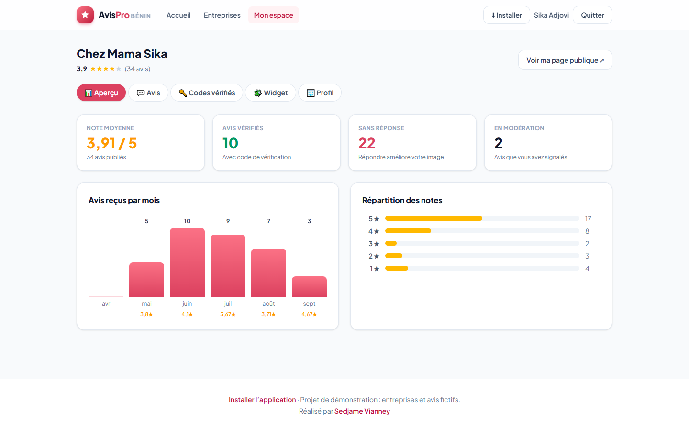

# AvisPro Bénin — Plateforme d’avis clients pour les PME

Plateforme inspirée de Trustpilot qui permet aux PME, artisans et commerces béninois de recueillir des avis
clients publics et de renforcer leur crédibilité en ligne. Projet n°3 du cahier des charges « 9 projets fictifs ».





## Fonctionnalités (MVP)

- Inscription d’une entreprise (profil, secteur d’activité, ville, description)
- Page publique par entreprise listant ses avis, avec note moyenne et répartition des notes
- Formulaire de dépôt d’avis (note de 1 à 5, commentaire, nom), sans compte
- Modération : l’entreprise signale un avis abusif, un modérateur le garde ou le retire
- Recherche d’entreprises par nom, secteur ou ville, avec tri (note, nombre d’avis, récentes)

## Fonctionnalités avancées (bonus)

- **Réponse publique** de l’entreprise à chaque avis
- **Badge « avis vérifié »** : l’entreprise génère des codes à usage unique (SMS/WhatsApp dans une version réelle)
- **Tableau de bord statistiques** : note moyenne, évolution sur 6 mois, répartition, avis sans réponse
- **Widget intégrable** : un script JS à coller sur le site de l’entreprise (`public/widget.js`, CORS activé)
- Application installable (PWA), interface adaptée mobile

## Sécurité

Requêtes préparées (Eloquent), validation côté serveur, texte nettoyé (`strip_tags`), authentification par
jetons Sanctum, limitation de débit (dépôt d’avis, connexion), un avis par jour et par entreprise (adresse IP
hachée avec HMAC), champ piège anti-robots, rôles vérifiés à chaque requête (une entreprise ne peut agir que sur
ses propres avis, seul l’administrateur modère).

## Stack

| Composant | Technologie |
|---|---|
| Backend / API | Laravel 12, Sanctum |
| Frontend | React 19 + Vite + Tailwind CSS 4 (dossier `frontend/`) |
| Base de données | MySQL |
| Documentation API | Collection Postman : [`docs/AvisPro.postman_collection.json`](docs/AvisPro.postman_collection.json) |

Modèle de données : `entreprises (id, nom, secteur, ville, description…)`,
`avis (id, entreprise_id, auteur, note, commentaire, statut, date…)`, `reponses (id, avis_id, contenu, date)`,
`codes_verification (id, entreprise_id, code, utilise_le)`.

## Installation

```bash
composer install
cp .env.example .env            # renseignez la base MySQL (DB_DATABASE, DB_USERNAME, DB_PASSWORD)
php artisan key:generate
php artisan migrate --seed      # crée les tables et des entreprises de démonstration
php artisan serve               # http://127.0.0.1:8000
```

L’interface React est déjà compilée dans `public/spa`. Pour la modifier :

```bash
cd frontend && npm install && npm run build
```

Tests : `php artisan test` (8 tests : recherche, avis, anti-spam, vérification, droits, modération).

## Comptes de démonstration

| Rôle | E-mail | Mot de passe |
|---|---|---|
| Entreprise (Chez Mama Sika) | `demo@avispro.bj` | `demo1234` |
| Modérateur | `admin@avispro.bj` | `admin1234` |

Codes de vérification de démonstration : `DEMO01`, `DEMO02`, `DEMO03`. Les entreprises et les avis sont fictifs.

## Widget

```html
<div data-avispro="chez-mama-sika"></div>
<script src="https://VOTRE-SITE/widget.js" async></script>
```

Auteur : [Sedjame Vianney](https://sedjame-vianney.vercel.app)
